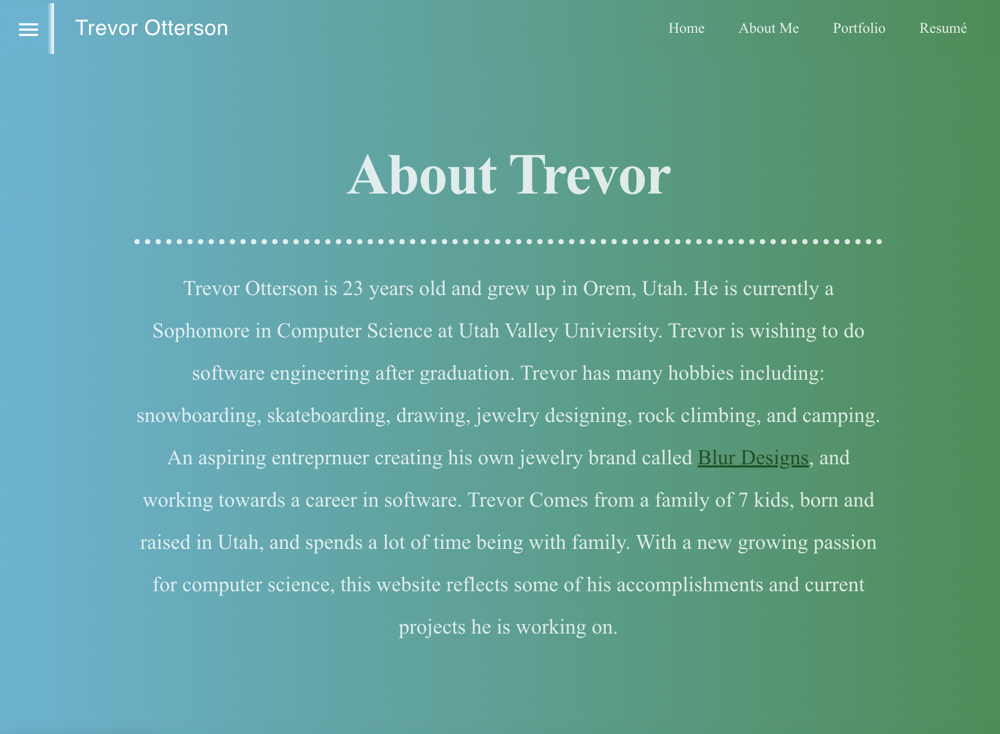
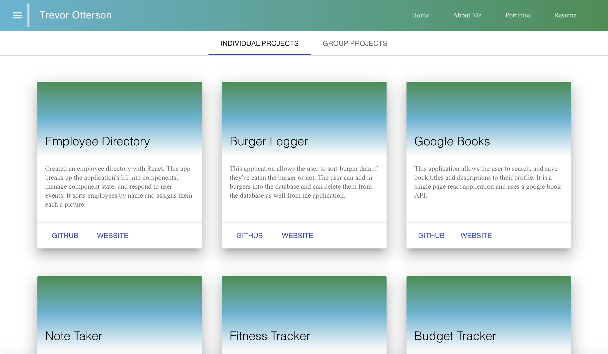
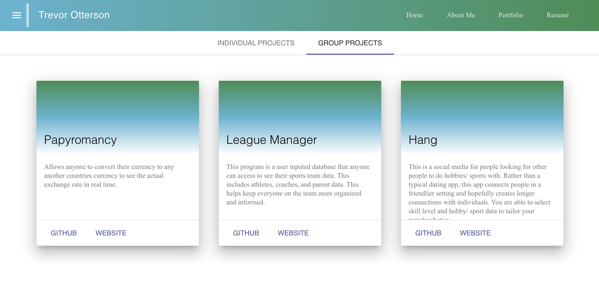

# `React Portfolio`

In this application I created a personal portfolio that talks about me as a developer and showcases my projects. My portfolio tab has descriptions of all my projects and links to their git hub repositories and deployed website links.

## Screenshots

